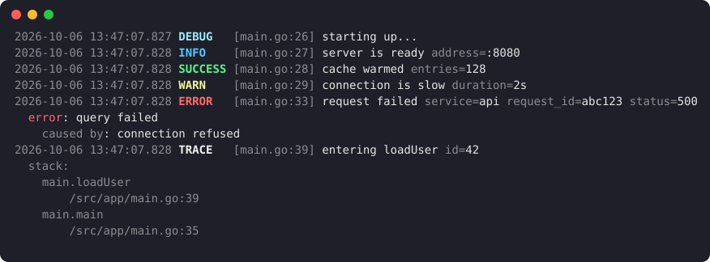

<p align="center">
  
</p>

<h1 align="center">gloq</h1>

<p align="center">
  Colorful structured logging for Go, built on <code>log/slog</code>.
</p>

<p align="center">
  <a href="https://pkg.go.dev/github.com/skinleak/gloq"></a>
  <a href="https://github.com/skinleak/gloq/actions/workflows/ci.yml"></a>
  <a href="go.mod"></a>
  <a href="LICENSE"></a>
</p>

<p align="center">
  
</p>

gloq is a lightweight structured logging library for Go. Inspired by tslog and
built directly on the standard [`log/slog`](https://pkg.go.dev/log/slog)
package, it combines readable, color-coded console logs for development with
structured JSON output for production.

## Why gloq?

- **It is slog.** Loggers are ordinary `*slog.Logger` values and the handler
  passes `testing/slogtest`, so gloq works with every library that accepts
  slog, and you can swap it for another handler at any time.
- **One logger for development and production.** Pretty, aligned terminal
  output while you work; newline-delimited JSON in production, chosen
  automatically with `FormatAuto`.
- **Errors are first-class.** Wrapped and joined errors are rendered as a
  readable chain in the terminal and as structured objects in JSON.
- **More expressive levels.** `TRACE` records carry their call stack,
  `SUCCESS` marks things that went right, and `FATAL` exits cleanly after
  running your shutdown hooks.
- **Safe to log untrusted data.** Newlines and terminal control sequences in
  messages, keys, values, and errors are escaped, so logged input can never
  forge a log line or take over a terminal.
- **No dependencies** beyond the standard library.

Plain `slog.TextHandler` has no colors, level names, or error chains.
Colorizing handlers such as tint cover development output only. If raw JSON
throughput is your main concern, zap or zerolog are faster; see the
[benchmark report](benchmarks/comparison/REPORT.md) for measured numbers
against zap and slog.

## Installation

```sh
go get github.com/skinleak/gloq
```

## Quick Start

```go
package main

import "github.com/skinleak/gloq"

func main() {
	gloq.Info("server is ready", "address", ":8080")
	gloq.Success("cache warmed", "entries", 128)
	gloq.Warn("connection is slow", "duration", "2s")
	gloq.Error("request failed", "status", 500)
}
```

Example output:

```text
2026-09-21 10:30:15.123 INFO    [main.go:6] server is ready address=:8080
2026-09-21 10:30:15.124 SUCCESS [main.go:7] cache warmed entries=128
2026-09-21 10:30:15.125 WARN    [main.go:8] connection is slow duration=2s
2026-09-21 10:30:15.126 ERROR   [main.go:9] request failed status=500
```

For anything bigger than a small program, create a logger. `gloq.NewLogger`
returns a `*gloq.Logger`: a `*slog.Logger` with extra `Trace`, `Success`, and
`Fatal` methods. Child loggers, groups, and context-aware methods work as
usual:

```go
log := gloq.NewLogger()
requestLog := log.With("service", "api", "request_id", requestID)
requestLog.InfoContext(ctx, "request complete", "status", 200)
requestLog.Success("order placed", "order_id", 42)
```

Use `gloq.New` for a plain `*slog.Logger`, `gloq.NewHandler` to plug gloq into
your own `slog.Logger`, or `gloq.Wrap` to add the extra methods to an existing
one.

Colors are enabled automatically for terminals, including Windows consoles,
and disabled for redirected output. Set `NO_COLOR=1` or `FORCE_COLOR=0` to
turn them off, `FORCE_COLOR=1` to force them on, or use `gloq.WithColor`.

## Log Levels

Built-in levels are ordered:

```text
TRACE < DEBUG < INFO < SUCCESS < WARN < ERROR < FATAL
```

| Level     | `slog` value | Description                                                    |
| --------- | -----------: | -------------------------------------------------------------- |
| `TRACE`   |           -8 | Very detailed diagnostics with an automatic call stack         |
| `DEBUG`   |           -4 | Detailed diagnostic information                                |
| `INFO`    |            0 | General informational messages                                 |
| `SUCCESS` |            2 | Successful or positive events                                  |
| `WARN`    |            4 | Potential problems that do not stop the program                |
| `ERROR`   |            8 | Errors that prevent an operation from completing               |
| `FATAL`   |           12 | Errors that stop the program; `Fatal` exits with status code 1 |

Every `TRACE` record includes the call stack of the code that logged it, in
both formats and however it was logged. `Fatal` and `FatalContext`, both on
`*gloq.Logger` and as package functions, log the record and exit with status 1.
A record logged at `LevelFatal` with a plain `slog.Logger` is written but does
not exit.

Register `gloq.OnFatal` hooks to flush buffers or close exporters before the
program exits:

```go
gloq.OnFatal(func() { _ = tracerProvider.Shutdown(context.Background()) })
```

The default minimum level is `INFO`. Set a different threshold with
`gloq.WithLevel`, or read it from the environment:

```go
log := gloq.NewLogger(
	gloq.WithLevel(slog.LevelInfo),
	gloq.WithLevelFromEnv("LOG_LEVEL"), // e.g. LOG_LEVEL=trace
)
```

An invalid value is reported with a `WARN` record and the earlier level is
kept. To change the level while the program runs, pass a `*slog.LevelVar`:

```go
var level slog.LevelVar
log := gloq.NewLogger(gloq.WithLevel(&level))
level.Set(gloq.LevelTrace) // e.g. from an admin endpoint or signal handler
```

`gloq.ParseLevel` understands every level name, including `SUCCESS`, `TRACE`,
`FATAL`, offsets such as `INFO+1`, and is case-insensitive. The `gloq.Level`
type implements `encoding.TextUnmarshaler`, so it can be used directly with
`flag.TextVar` and in JSON, YAML, or TOML configuration.

The package-level helpers `Trace`, `Debug`, `Info`, `Success`, `Warn`, `Error`,
and `Fatal`, their `...Context` variants, and `gloq.With` use the default
logger, which can be replaced with `gloq.SetDefault`.

## JSON Logging

Switch to newline-delimited JSON for production logging:

```go
log := gloq.NewLogger(gloq.WithFormat(gloq.FormatJSON))
```

Or let gloq decide: `gloq.FormatAuto` writes pretty output to a terminal and
JSON everywhere else, such as in a container or when redirected to a file.

JSON output uses the standard slog field structure while preserving gloq's
custom level names and structured error handling. `TRACE` stacks are written
as an array of `{"function", "file", "line"}` objects.

## Context Values

Attach values carried by a `context.Context`, such as trace or request IDs, to
every record logged with that context:

```go
log := gloq.NewLogger(gloq.WithContextAttrs(func(ctx context.Context) []slog.Attr {
	span := trace.SpanContextFromContext(ctx)
	if !span.IsValid() {
		return nil
	}
	return []slog.Attr{slog.String("trace_id", span.TraceID().String())}
}))

log.InfoContext(ctx, "request complete")
```

## Redaction and Renaming

`gloq.WithReplaceAttr` works like `slog.HandlerOptions.ReplaceAttr` in both
formats:

```go
log := gloq.NewLogger(gloq.WithReplaceAttr(func(groups []string, attr slog.Attr) slog.Attr {
	if attr.Key == "password" {
		return slog.String("password", "[REDACTED]")
	}
	return attr
}))
```

## Structured Errors

Errors are rendered with their wrapped or joined causes automatically:

```go
gloq.Error("could not load user", "error", err)
```

```text
2026-09-21 10:30:15.126 ERROR   [user.go:31] could not load user
  error: query failed
    caused by: connection refused
```

JSON logs store the error message, concrete type, and causes as structured
fields. Use `gloq.WithErrorStack(true)` to include stack details provided by
the error value.

## Testing

`gloq.NewTestLogger` writes to a test's log, so output only shows up for failing
tests or with `go test -v`:

```go
func TestCheckout(t *testing.T) {
	service := checkout.New(gloq.NewTestLogger(t))
	// ...
}
```

It logs every level without colors unless you pass options, and drops records
written after the test has finished.

## Configuration

Pass options to `gloq.New`, `gloq.NewLogger`, or `gloq.NewHandler`:

| Option             | Purpose                                                |
| ------------------ | ------------------------------------------------------ |
| `WithLevel`        | Set the minimum enabled log level                      |
| `WithLevelFromEnv` | Read the minimum level from an environment variable    |
| `WithFormat`       | Choose pretty, JSON, or automatic output               |
| `WithColor`        | Enable, disable, or automatically detect color support |
| `WithSource`       | Show or hide the caller's source file and line         |
| `WithSourcePath`   | Show the file name, its directory, or the full path    |
| `WithErrorStack`   | Include stack information exposed by error values      |
| `WithTimeFormat`   | Customize the pretty timestamp layout                  |
| `WithTimeZone`     | Convert timestamps to a time zone, such as `time.UTC`  |
| `WithReplaceAttr`  | Rewrite, rename, or remove attributes                  |
| `WithContextAttrs` | Add attributes taken from each record's context        |

See the [Go package documentation](https://pkg.go.dev/github.com/skinleak/gloq)
for the complete API.

## Performance

The pretty handler formats attributes added with `With` once, reuses its
buffers, and caches source locations, so most records need no allocations.
Run `go test -bench .` for the handler benchmarks and see
[benchmarks/comparison](benchmarks/comparison/README.md) for comparisons with
slog and zap.

## Compatibility

gloq supports Go 1.21 and newer and follows semantic versioning. Breaking API
changes will only be released in a new major version.

## Contributing

Contributions are welcome. See [CONTRIBUTING.md](CONTRIBUTING.md) to get
started. Report security issues privately as described in
[SECURITY.md](SECURITY.md).

## License

gloq is available under the [MIT License](LICENSE).
